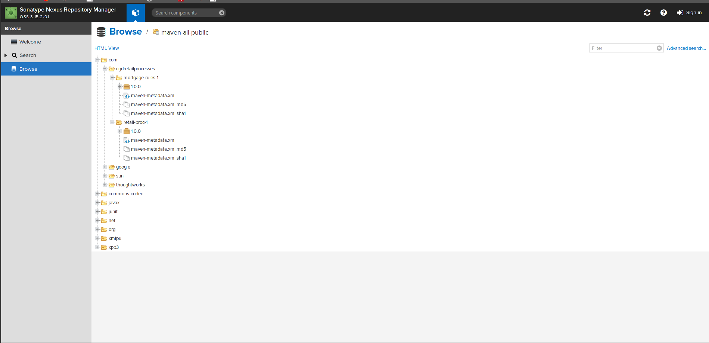
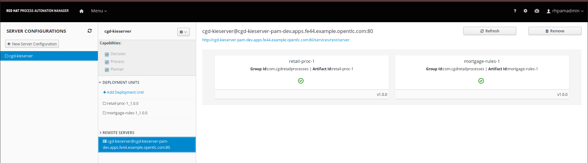
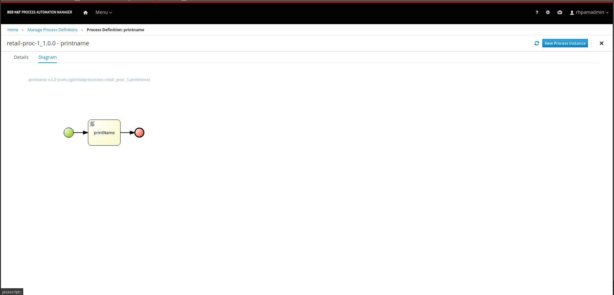
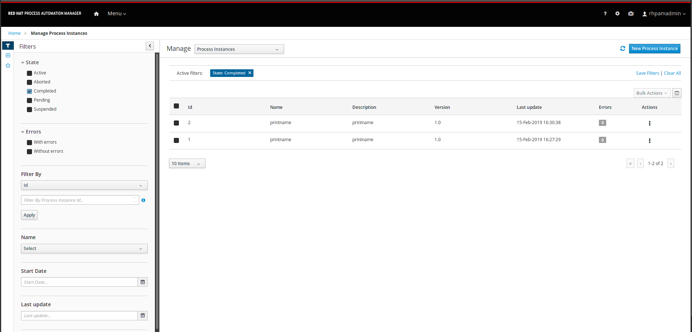
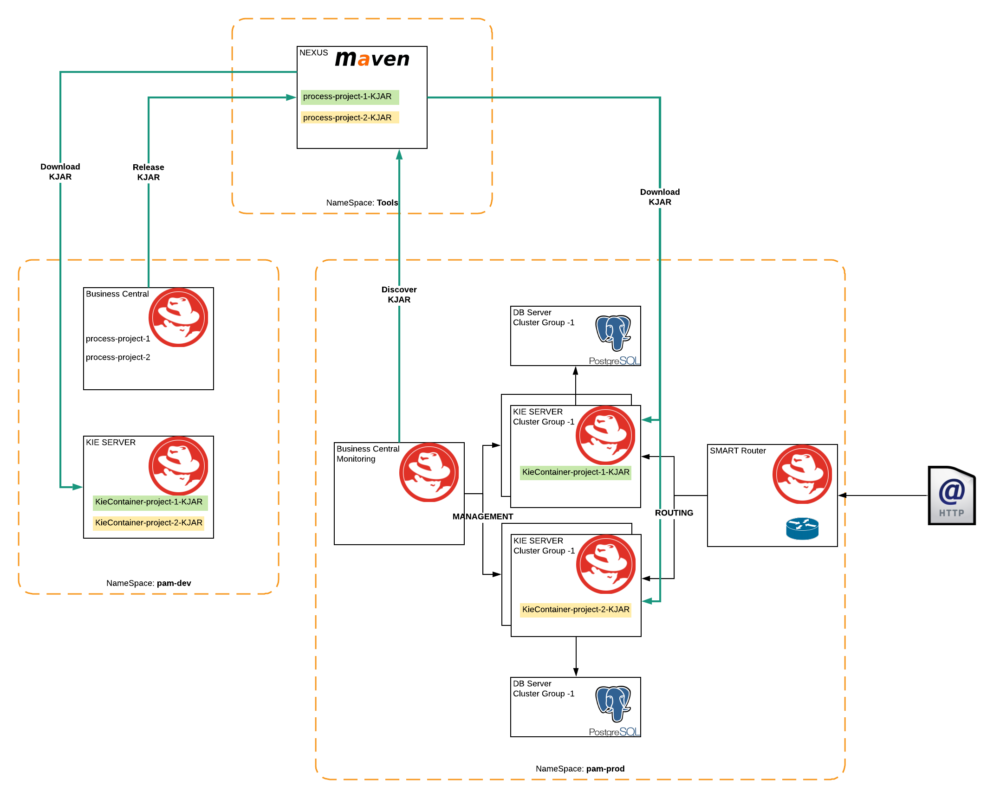
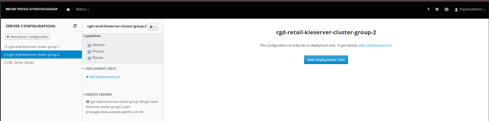
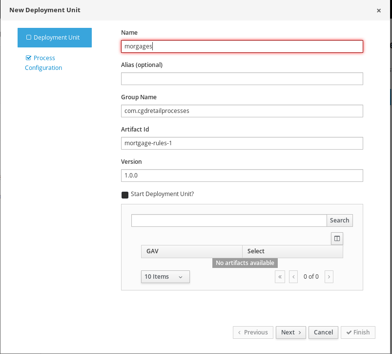
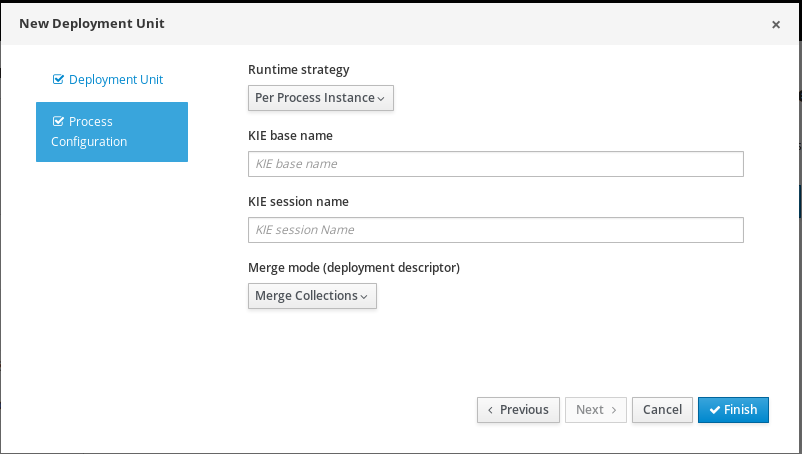
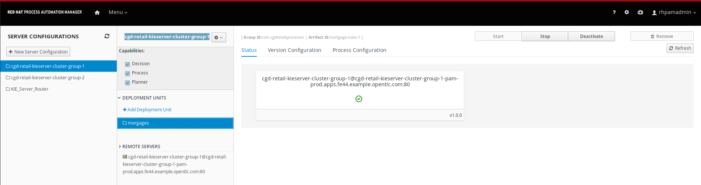

= OCP APP DEV WITH RH PAM
:toc:

== Making Preperations

=== Access to RH Registry

Directions: https://access.redhat.com/solutions/3812291

	oc create secret generic imagestreamsecret --from-file=.dockerconfigjson=/home/stkousso/Stelios/sw11/PAAS/Distros/minishift/1.27/minishift-1.27.0-linux-amd64/config.json --type=kubernetes.io/dockerconfigjson

=== RHSSO

* Installing link:https://access.redhat.com/documentation/en-us/red_hat_jboss_middleware_for_openshift/3/html-single/red_hat_single_sign-on_for_openshift/#using_the_rh_sso_for_openshift_image_streams_and_application_templates[RHSSO 7.2] Templates & Images

	oc login -u system:admin
	cd ./ocp_pam_app_dev
	./Infrastructure/scripts/prepare_env_sso.sh

=== Nexus

* No special prep required if access to external Red Hat Maven repositories is possible and 
* The NEXUS image 'docker.io/sonatype/nexus3' is possible to download

=== RHPAM

==== Image Stream

	cd ./ocp_pam_app_dev
	unzip ./resources/rhpam-7.2.0-openshift-templates.zip
        oc get is -n openshift |grep rhpam
	oc create -f ./resources/rhpam72-image-streams.yaml -n openshift
        oc get is -n openshift |grep rhpam

==== Put RHPAM images in place

* Check existing images (as cluster admin). we need rhpam72

	oc get images |grep rhpam

* *Business Central*: A platform for authoring business assets such as data objects, rules, processes, cases, and planning entities.

	oc import-image my-rhpam-7/rhpam72-businesscentral-openshift --from=registry.access.redhat.com/rhpam-7/rhpam72-businesscentral-openshift --confirm -n openshift

* *KIE Server* REST services runtime environment for business assets such as business processes, rules, cases, and planning entities.

	oc import-image my-rhpam-7/rhpam72-kieserver-openshift --from=registry.access.redhat.com/rhpam-7/rhpam72-kieserver-openshift --confirm -n openshift

* *KIE (Standalone) Controller*:  A component for managing multiple KIE Servers (Process, Decision, Planning) in manage mode.

	oc import-image my-rhpam-7/rhpam72-controller-openshift --from=registry.access.redhat.com/rhpam-7/rhpam72-controller-openshift --confirm -n openshift

* *Smart Router*: Load balancing, unified view on available business assets, and aggregation of responses throughout multiple KIE Servers (Process, Decision, Planning).

	oc import-image my-rhpam-7/rhpam72-smartrouter-openshift --from=registry.access.redhat.com/rhpam-7/rhpam72-smartrouter-openshift --confirm -n openshift

* *Business Central Monitoring*: A platform for monitoring and management of business assets.

	oc import-image my-rhpam-7/rhpam72-businesscentral-monitoring-openshift --from=registry.access.redhat.com/rhpam-7/rhpam72-businesscentral-monitoring-openshift --confirm -n openshift

==== Insert Templates

	cd ./ocp_pam_app_dev
	oc create -f ./resources/<template-name> -n openshift

==== Custom Tempates

* Template Name:
** location:
** purpose:

== CI/CD PoC Setups

=== Tools project

	oc new-project <YOUR-TOOLS-NAEMSPACE>tools
	
1. create nexus + rh proxy repos

		cd ./ocp_pam_app_dev
		oc login -u <CLUSTER PUBLIC IP> -u <USERNAME> -p <PASSWORD>
		oc project tools
		# oc create -f nexus-dc.yaml -n tools
		./Infrastructure/scripts/setup_nexus.sh <YOUR-TOOLS-NAEMSPACE>tools <CLUSTER PUBLIC URL>192.168.42.21

2. SSO Setp

		oc login -u <CLUSTER PUBLIC IP> -u <USERNAME> -p <PASSWORD>
		oc project tools
		#oc new-app --template=openshift/sso72-x509-https -p APPLICATION_NAME=cgd-sso -p SSO_ADMIN_USERNAME=ssoadmin -p SSO_ADMIN_PASSWORD=ssoadmin720! -l app=sso -n tools
		./Infrastructure/scripts/setup_sso.sh tools FALSE
		
3. jenkins
4. gogs
5. quay.io

=== DEV Project

* *Business Central* Installation/Configuration:

	cd ./ocp_pam_app_dev
	oc login -u <CLUSTER PUBLIC IP> -u <USERNAME> -p <PASSWORD>
	oc project pam-dev
	oc create -f Infrastructure/templates/rhpam72-authoring-stelios-1.yaml
	./Infrastructure/scripts/setup_DEV_managed.sh <YOUR-DEV-NAMESPACE>pam-dev <YOUR-TOOLS-NAMESPACE>tools

	KIE Server Check: "curl -u executionUser:executionUser123 --insecure https://secure-cgd-kieserver-<YOUR-DEV-NAMESPACE>.apps.<CLUSTER-NAME>/services/rest/server"
	RHPAM Central Login: rhpamAdmin/rhpamAdmin720

** Create Project
*** *Step 1*: Create processes, rules etc.
*** *Step 2*: since no CI-CD we will distribute KJARs directly from 'Business Central' into NEXUS to achieve this
**** Add on any new project in the settings.xml (see 'setup_DEV_managed.sh' output log) the following for distribution to NEXUS (*Note: <id>nexus</id> MUST match the'<servers><server><id>nexus</id>' in *Infrastructure/templates/settings.xml*

	 <distributionManagement>
	   <repository>
	     <id>nexus</id>
	     <url>http://<NEXUS-ROUTE-URL>/repository/maven-releases</url>
	   </repository>
	   <snapshotRepository>
	     <id>nexus</id>
	     <url>http://<NEXUS-ROUTE-URL>/repository/maven-snapshots</url>
	   </snapshotRepository>
	 </distributionManagement>	

**** 'Deploy' from 'Business Central' into the KieServer and confirm that KieContainer is started by looking for the appropriate *container-alias*

	curl -u executionUser:executionUser123 -X GET "https://secure-cgd-kieserver-pam-dev.apps.fe44.example.opentlc.com/services/rest/server/containers" --insecure -H  "accept: application/xml"

	[RESPONSE]
	----------------------------------
	<?xml version="1.0" encoding="UTF-8" standalone="yes"?>
	<response type="SUCCESS" msg="List of created containers">
	    <kie-containers>
		<kie-container container-alias="retail-proc-1" container-id="retail-proc-1_1.0.0" status="STARTED">
		    <config-items>
		        <itemName>KBase</itemName>
		        <itemValue></itemValue>
		        <itemType>BPM</itemType>
		    </config-items>
		    <config-items>
		        <itemName>KSession</itemName>
		        <itemValue></itemValue>
		        <itemType>BPM</itemType>
		    </config-items>
		    <config-items>
		        <itemName>MergeMode</itemName>
		        <itemValue>MERGE_COLLECTIONS</itemValue>
		        <itemType>BPM</itemType>
		    </config-items>
		    <config-items>
		        <itemName>RuntimeStrategy</itemName>
		        <itemValue>SINGLETON</itemValue>
		        <itemType>BPM</itemType>
		    </config-items>
		    <messages>
		        <content>Container retail-proc-1_1.0.0 successfully created with module com.cgdretailprocesses:retail-proc-1:1.0.0.</content>
		        <severity>INFO</severity>
		        <timestamp>2019-02-15T16:17:43.934Z</timestamp>
		    </messages>
		    <release-id>
		        <artifact-id>retail-proc-1</artifact-id>
		        <group-id>com.cgdretailprocesses</group-id>
		        <version>1.0.0</version>
		    </release-id>
		    <resolved-release-id>
		        <artifact-id>retail-proc-1</artifact-id>
		        <group-id>com.cgdretailprocesses</group-id>
		        <version>1.0.0</version>
		    </resolved-release-id>
		    <scanner status="DISPOSED"/>
		</kie-container>
	    </kie-containers>
	</response>

***** Check NEXUS where now the KJAR(s) would have been uploaded to and where the DEV KieServer has been configued to download them from Definitions*

	http://nexus3-tools.apps.fe44.example.opentlc.com/#browse/browse:maven-all-public

***** Go to Business Central *Menu --> Execution Servers" & Click on the Remote Servers (only one available) too see the KieContainers created from the deployed KJARs

**** 'Find' the process in the deployed KJAR (ie. the runnalable RHPAM projet) by using from the previous result the alias or id of the KieContainer (container-alias="retail-proc-1" container-id="retail-proc-1_1.0.0")

	curl -u executionUser:executionUser123 -X GET "https://secure-cgd-kieserver-pam-dev.apps.fe44.example.opentlc.com/services/rest/server/containers/retail-proc-1/processes?page=0&pageSize=10&sortOrder=true" --insecure -H  "accept: application/xml"

	[RESPONSE]
	----------------------------------
	<?xml version="1.0" encoding="UTF-8" standalone="yes"?>
	<process-definitions>
	    <processes>
		<process-id>com.cgdretailprocesses.retail_proc_1.printname</process-id>
		<process-name>printname</process-name>
		<process-version>1.0</process-version>
		<package>com.cgdretailprocesses.retail_proc_1</package>
		<container-id>retail-proc-1_1.0.0</container-id>
		<dynamic>false</dynamic>
	    </processes>
	</process-definitions>

**** 'Execute' against the KieContainer by starting a new process
***** Using the *alias* 

	curl -u executionUser:executionUser123 --insecure -X POST "https://secure-cgd-kieserver-pam-dev.apps.fe44.example.opentlc.com/services/rest/server/containers/retail-proc-1/processes/com.cgdretailprocesses.retail_proc_1.printname/instances" -H  "accept: application/xml" -H  "content-type: application/xml" -d "<?xml version=\"1.0\" encoding=\"UTF-8\" standalone=\"yes\"?><map-type>    <entries>        <entry>            <key>age</key>            <value xsi:type=\"xs:int\" xmlns:xs=\"http://www.w3.org/2001/XMLSchema\"                    xmlns:xsi=\"http://www.w3.org/2001/XMLSchema-instance\">25</value>        </entry>        <entry>            <key>person</key>            <value xsi:type=\"person\" xmlns:xsi=\"http://www.w3.org/2001/XMLSchema-instance\">                <name>john</name>            </value>        </entry>    </entries></map-type>"

	[RESPONSE]
	----------------------------------
	<?xml version="1.0" encoding="UTF-8" standalone="yes"?>
	<long-type>
	      <value>1</value>
	</long-type>

***** Using the *container-id* 

	curl -u executionUser:executionUser123 --insecure -X POST "https://secure-cgd-kieserver-pam-dev.apps.fe44.example.opentlc.com/services/rest/server/containers/retail-proc-1_1.0.0/processes/com.cgdretailprocesses.retail_proc_1.printname/instances" -H  "accept: application/xml" -H  "content-type: application/xml" -d "<?xml version=\"1.0\" encoding=\"UTF-8\" standalone=\"yes\"?><map-type>    <entries>        <entry>            <key>age</key>            <value xsi:type=\"xs:int\" xmlns:xs=\"http://www.w3.org/2001/XMLSchema\"                    xmlns:xsi=\"http://www.w3.org/2001/XMLSchema-instance\">25</value>        </entry>        <entry>            <key>person</key>            <value xsi:type=\"person\" xmlns:xsi=\"http://www.w3.org/2001/XMLSchema-instance\">                <name>john</name>            </value>        </entry>    </entries></map-type>"

	[RESPONSE]
	----------------------------------
	<?xml version="1.0" encoding="UTF-8" standalone="yes"?>
	<long-type>
	      <value>2</value>
	</long-type>

***** To see the current deployed process definitions *Menu --> Process Definitions*

	https://secure-cgd-rhpamcentr-pam-dev.apps.fe44.example.opentlc.com/kie-wb.jsp#ProcessDefinitions%7CProcessDefinitionListScreen

***** To see the current deployed process definitions *Menu --> Process Instances*

												
=== PROD Project

	cd ./ocp_pam_app_dev
	oc login -u <CLUSTER PUBLIC IP> -u <USERNAME> -p <PASSWORD>
	oc project pam-prod
	oc create -f Infrastructure/templates/rhpam72-prod-stelios-1.yaml
	./Infrastructure/scripts/setup_PROD_managed.sh <YOUR-DEV-NAMESPACE>pam-prod <YOUR-TOOLS-NAMESPACE>tools

==== Resulting Installation

- *Business Central Monitor*: https://secure-cgd-retail-rhpamcentrmon-pam-prod.apps.fe44.example.opentlc.com/ (rhpamAdmin/rhpamAdmin720, used to deploy KJAR projects, manage KJAR and template configurations, monitor)
- *Smart Router*: http://cgd-retail-smartrouter-pam-prod.apps.fe44.example.opentlc.com/ (Service used as smart proxy of processes on any connected KIESERVER cluster group)
- *KIE Server Cluster Group-1*: https://secure-cgd-retail-kieserver-cluster-group-1-pam-prod.apps.fe44.example.opentlc.com/docs
- *cgd-retail-postgresql-1*: Database dedicated for *KIE Server Cluster Group-1* (Runs a KJAR(s) related to a division and has dedicated Database)
- *KIE Server Cluster Group-2*: https://secure-cgd-retail-kieserver-cluster-group-2-pam-prod.apps.fe44.example.opentlc.com/docs
- *cgd-retail-postgresql-1*: Database dedicated for *KIE Server Cluster Group-2* (Runs a *separate from Cluster Group-1* KJAR(s) related to a *secondary* division and has dedicated Database)

==== Deploying, Executing, Monitoring, Managing Process Projects in PROD
	
* *Step 1*: Login to *Business Central Monitor* (above) and inspect the deployments on the different Server Configuration (Templates). There should be 3 (see below)

* *Step 2*: There are no Deployment Units (ie. KJARs with processes/rules to deploy) as they exist remotely on the nexus server. With the *cgd-retail-kieserver-cluster-group-1* selected press *Add Deployment Unit* and add (as per screenshots) the KJAR (based on your project's Group Artifact Version -GAV- details-) the KJAR you wish deployed in the GROUP Of KIESERVERs that will use RHPAM template configuration *cgd-retail-kieserver-cluster-group-1* 

** Use the "Start" button to initialize the RHPAM Process project (KieContainer) inside the KIESERVERs (should get a gree

** Side note: The JARs are downloaded locally at '/opt/eap/standalone/data/kie/maven-repository/' in the container

* *Step 3*: Retrieve ALL Active KieContainers (ie. projects to execute processes against) using the *Smart Router* rather than individual KIESERVER cluster groups

	# curl -u executionUser:executionUser123 -X GET "http://cgd-retail-smartrouter-pam-prod.apps.fe44.example.opentlc.com/containers" -H  "accept: application/xml"

	<?xml version="1.0" encoding="UTF-8"?>
	<response msg="List of created containers" type="SUCCESS">    
	  <kie-containers>        
	    <kie-container container-alias="" container-id="morgages" status="STARTED">            
	      <config-items>                
		<itemName>KBase</itemName>                
		<itemValue/>                
		<itemType>BPM</itemType>            
	      </config-items>            
	      <config-items>                
		<itemName>KSession</itemName>                
		<itemValue/>                
		<itemType>BPM</itemType>            
	      </config-items>            
	      <config-items>                
		<itemName>MergeMode</itemName>                
		<itemValue>MERGE_COLLECTIONS</itemValue>                
		<itemType>BPM</itemType>            
	      </config-items>            
	      <config-items>                
		<itemName>RuntimeStrategy</itemName>                
		<itemValue>PER_PROCESS_INSTANCE</itemValue>                
		<itemType>BPM</itemType>            
	      </config-items>            
	      <messages>                
		<content>Container morgages successfully created with module com.cgdretailprocesses:mortgage-rules-1:1.0.0.</content>                
		<severity>INFO</severity>                
		<timestamp>2019-02-16T10:27:27.116Z</timestamp>            
	      </messages>            
	      <release-id>                
		<artifact-id>mortgage-rules-1</artifact-id>               
		<group-id>com.cgdretailprocesses</group-id>                
		<version>1.0.0</version>            
	      </release-id>            
		    <resolved-release-id>                
		<artifact-id>mortgage-rules-1</artifact-id>                
		<group-id>com.cgdretailprocesses</group-id>                
		<version>1.0.0</version>            
	      </resolved-release-id>            
	      <scanner status="DISPOSED"/>
	    </kie-container>
	  </kie-containers>        

** Retrieve Available processes in KieContainer

	# curl -u executionUser:executionUser123 -X GET "http://cgd-retail-smartrouter-pam-prod.apps.fe44.example.opentlc.com/containers/morgages/processes" -H  "accept: application/xml"

	<?xml version="1.0" encoding="UTF-8" standalone="yes"?>
	<process-definitions>
	    <processes>
		<process-id>com.cgdretailprocesses.loanapproval</process-id>
		<process-name>loanapproval</process-name>
		<process-version>1.0</process-version>
		<package>com.cgdretailprocesses</package>
		<container-id>morgages</container-id>
		<dynamic>false</dynamic>
	    </processes>
	</process-definitions>

** Check the *Smart Router* configuration manually

	oc rsh cgd-retail-smartrouter-1-7f2cw
	$ cat /opt/rhpam-smartrouter/data/kie-server-router.json   
	{
	  "containerInfo": [{
	    "alias": "mortgage-rules-1",
	    "containerId": "morgages",
	    "releaseId": "com.cgdretailprocesses:mortgage-rules-1:1.0.0"
	  }],
	  "containers": [
	    {"mortgage-rules-1": ["http://cgd-retail-kieserver-cluster-group-1-pam-prod.apps.fe44.example.opentlc.com:80/services/rest/server"]},
	    {"morgages": ["http://cgd-retail-kieserver-cluster-group-1-pam-prod.apps.fe44.example.opentlc.com:80/services/rest/server"]}
	  ],
	  "servers": [{"cgd-retail-kieserver-cluster-group-1": ["http://cgd-retail-kieserver-cluster-group-1-pam-prod.apps.fe44.example.opentlc.com:80/services/rest/server"]}]
	}	

** *Step 4*: Execute process *com.cgdretailprocesses.loanapproval* on KieContainer *morgages* and KIESERVERs *cgd-retail-kieserver-cluster-group-1* via the *Smart Router* configuration manually

	curl -u executionUser:executionUser123 -X POST "http://cgd-retail-smartrouter-pam-prod.apps.fe44.example.opentlc.com/containers/morgages/processes/com.cgdretailprocesses.loanapproval/instances" -H  "accept: application/xml" -H  "content-type: application/xml" -d "<?xml version=\"1.0\" encoding=\"UTF-8\" standalone=\"yes\"?><map-type>    <entries>        <entry>            <key>age</key>            <value xsi:type=\"xs:int\" xmlns:xs=\"http://www.w3.org/2001/XMLSchema\"                    xmlns:xsi=\"http://www.w3.org/2001/XMLSchema-instance\">25</value>        </entry>        <entry>            <key>person</key>            <value xsi:type=\"person\" xmlns:xsi=\"http://www.w3.org/2001/XMLSchema-instance\">                <name>john</name>            </value>        </entry>    </entries></map-type>"

	[RESPONSE]
	----------------------------------
	<?xml version="1.0" encoding="UTF-8" standalone="yes"?>
	<long-type>
	    <value>1</value>
	</long-type>

	Check the logs of the pod running the 'morgages' KieContainer
	--------------------------------------------------------------
	# oc logs -f cgd-retail-kieserver-cluster-group-1-1-wqsp
	10:27:27,105 INFO  [org.kie.server.services.impl.KieServerImpl] (default task-1) Container morgages (for release id com.cgdretailprocesses:mortgage-rules-1:1.0.0) successfully started
	10:27:27,164 INFO  [org.kie.server.router.client.KieServerRouterEventListener] (default task-1) Added 'http://cgd-retail-kieserver-cluster-group-1-pam-prod.apps.fe44.example.opentlc.com:80/services/rest/server' as server location for container id 'morgages'
	11:06:25,368 INFO  [stdout] (default task-1) LOAN APPROVED

=== Installing PRODUCTION environment with SINGLE external Database Server for proceses

* You have logged on to your project in the OpenShift environment using the oc command as a user with the *cluster-admin* role.
* For Oracle DB driver can be found in this repository Link:https://github.com/skoussou/ocp_pam_app_dev/blob/master/Infrastructure/resources/drivers/oracle/com/oracle/ojdbc7/12.1.0.1/ojdbc7-12.1.0.1.jar[here]
* For IBM DB2, Oracle Database, or Sybase, you have downloaded the JDBC driver from the database server vendor. More in Link:3.4. Building a custom Process Server image for an external database[documentation here]
* Install the source code for the custom build,

	cd ./ocp_pam_app_dev
	oc login -u <CLUSTER PUBLIC IP> -u <USERNAME> -p <PASSWORD>
        oc project pam-prod
	unzip ./resources/rhpam-7.2.0-openshift-templates.zip
	cd ./resources/templates/contrib/jdbc
	[root@bastion jdbc]# ll
	total 12
	-rwxrwxr-x. 1 ec2-user ec2-user 3012 Jan 18 09:37 build.sh
	drwxrwxr-x. 3 ec2-user ec2-user   65 Jan 18 09:37 db2-driver-image
	drwxrwxr-x. 3 ec2-user ec2-user   65 Feb 15 13:20 derby-driver-image
	-rwxrwxr-x. 1 ec2-user ec2-user  459 Jan 18 09:37 install.sh
	drwxrwxr-x. 3 ec2-user ec2-user   65 Jan 18 09:37 mariadb-driver-image
	drwxrwxr-x. 3 ec2-user ec2-user   65 Feb 15 13:20 mssql-driver-image
	drwxrwxr-x. 3 ec2-user ec2-user   65 Feb 15 13:20 oracle-driver-image
	-rw-rw-r--. 1 ec2-user ec2-user 1933 Jan 18 09:37 README.md
	drwxrwxr-x. 3 ec2-user ec2-user   65 Jan 18 09:37 sybase-driver-image

==== Preparing RHPAM image For MariaDB, mariadb-driver-image

* Change to subdirectory: *mariadb-driver-image*
** #../build.sh [--registry=myregistry.example.com:5000] [--artifact-repo=https://myrepo.example.com/maven/public] [--image-tag=1.1 ]

	cd ./resources/templates/contrib/jdbc/*mariadb-driver-image/
	../build.sh --registry=docker-registry.default.svc:5000
	...
	--> Creating resources with label build=rhpam72-kieserver-mariadb-openshift ...
	    imagestream.image.openshift.io "rhpam72-kieserver-mariadb-openshift" created
	    buildconfig.build.openshift.io "rhpam72-kieserver-mariadb-openshift" created
	--> Success

** Check for the newly built RHPAM2 image/ImageStream *rhpam72-kieserver-mariadb-openshift* which contains *mariadb* database driver
	# oc get is -n openshift |grep rhpam72-kieserver-mariadb-openshift
	rhpam72-kieserver-mariadb-openshift            docker-registry.default.svc:5000/openshift/rhpam72-kieserver-mariadb-openshift

	# oc describe is rhpam72-kieserver-mariadb-openshift -n openshift
	Name:                   rhpam72-kieserver-mariadb-openshift
	Namespace:              openshift
	Created:                4 minutes ago
	Labels:                 build=rhpam72-kieserver-mariadb-openshift
	Annotations:            openshift.io/generated-by=OpenShiftNewBuild
	Docker Pull Spec:       docker-registry.default.svc:5000/openshift/rhpam72-kieserver-mariadb-openshift
	Image Lookup:           local=false
	Unique Images:          1
	Tags:                   1
	1.1
	  no spec tag
	  * docker-registry.default.svc:5000/openshift/rhpam72-kieserver-mariadb-openshift@sha256:6d330a9aa901c47e9937ed16732d46ceb000ae20a73afdb8b952d6249d5abdaf
	      About a minute ago

==== Preparing RHPAM image for Oracle Database, mariadb-driver-image

* Change to subdirectory: *oracle-driver-image*
** #../build.sh [--registry=myregistry.example.com:5000] [--artifact-repo=https://myrepo.example.com/maven/public] [--image-tag=1.1 ]

	cd ./resources/templates/contrib/jdbc/oracle-driver-image/
	../build.sh --artifact-repo="https://github.com/skoussou/ocp_pam_app_dev/tree/master/Infrastructure/resources/drivers/oracle" --registry=docker-registry.default.svc:5000
	...
	--> Creating resources with label build=rhpam72-kieserver-oracle-openshift ...
	    imagestream.image.openshift.io "rhpam72-kieserver-oracle-openshift" created
	    buildconfig.build.openshift.io "rhpam72-kieserver-oracle-openshift" created
	--> Success

** Check for the newly built RHPAM2 image/ImageStream *rhpam72-kieserver-oracle-openshift* which contains *oracle* database driver

	# oc get is rhpam72-kieserver-oracle-openshift -n openshift
	NAME                                 DOCKER REPO                                                                     TAGS      UPDATED
	rhpam72-kieserver-oracle-openshift   docker-registry.default.svc:5000/openshift/rhpam72-kieserver-oracle-openshift   1.1       47 seconds ago

	[root@master1 oracle-driver-image]# oc describe is rhpam72-kieserver-oracle-openshift -n openshift
	Name:                   rhpam72-kieserver-oracle-openshift
	Namespace:              openshift
	Created:                About a minute ago
	Labels:                 build=rhpam72-kieserver-oracle-openshift
	Annotations:            openshift.io/generated-by=OpenShiftNewBuild
	Docker Pull Spec:       docker-registry.default.svc:5000/openshift/rhpam72-kieserver-oracle-openshift
	Image Lookup:           local=false
	Unique Images:          1
	Tags:                   1
	1.1
	  no spec tag
	  * docker-registry.default.svc:5000/openshift/rhpam72-kieserver-oracle-openshift@sha256:e0720bec08445941b2944914f967433c2e093d54bad353c74de1082f289ba954
	      About a minute ago

==== Installing PROD with external mariadb database

	oc project pam-prod
	oc create -f Infrastructure/templates/rhpam72-PROD-mariadb-stelios-1.yaml
	./Infrastructure/scripts/setup_PROD_mariadb_managed.sh <YOUR-DEV-NAMESPACE>pam-dev <YOUR-TOOLS-NAMESPACE>tools

==== Installing PROD with external ORacle (to be done on-site)

=== Setting & Utilizing Openshift Autoscaler
	

